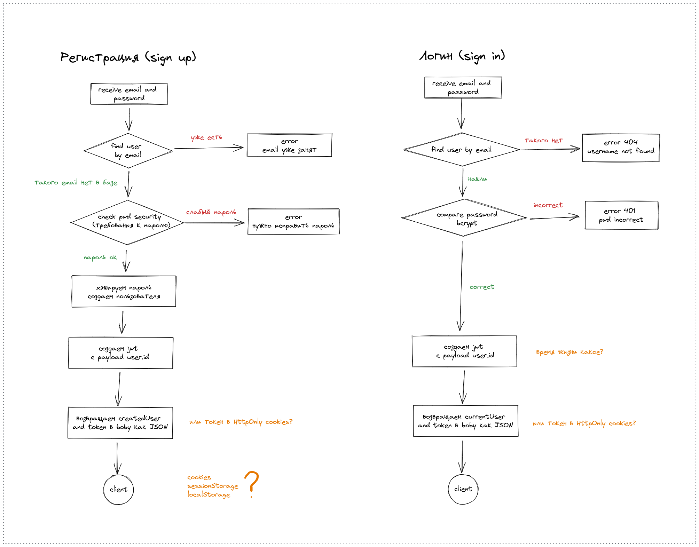
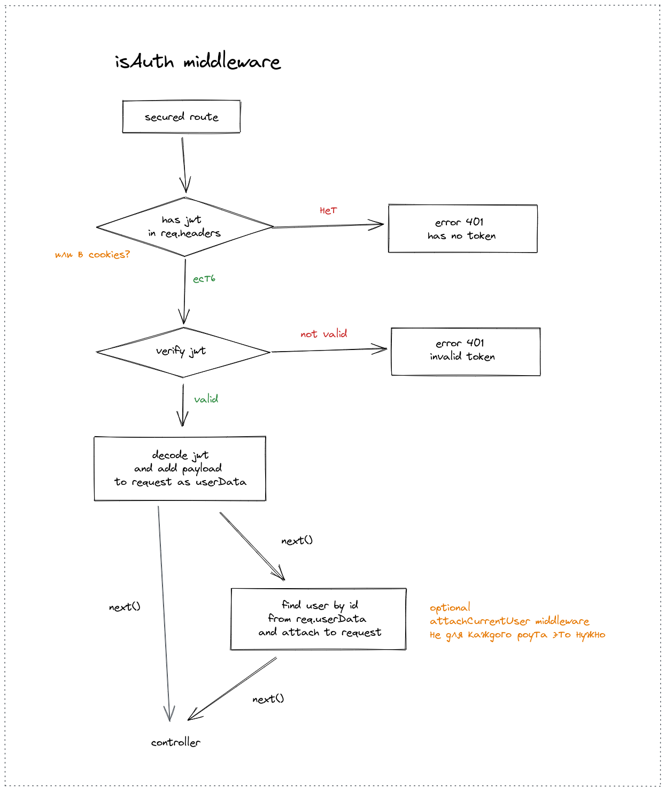

# Базовая аутентификация/авторизация пользователей, server

REST API, серверная часть, базовые принципы аутентификации/авторизации, (только `Access token`, без использования `Refresh token`) (токены обновления *будут* добавлены в `users-auth-secure-server`)

Front-end, клиент на Angular, здесь `auth-base-client`

## Техническое задание

* Express, база данных MongoDB, ODM Mongoose
* REST API, JSON, CORS
* Регистрация пользователя (sign up), авторизация (sign in, login), выход (logout)
* Без подтверждения email (данный функционал пока не реализован)
* Пароли при сохранении в БД хэшируются (`bcrypt`)
* Используется JWT, только `Access token`, без использования `Refresh token`
* `Access token` с клиента передается в cookies (альтернативный вариант в headers)
* `Access token` имеет время жизни, сессия или, например, 7 дней
* Нет механизма инвалидации `Access token`, токен будет валидным, пока не истечет его срок действия, logout просто удаляет cookie с токеном
* Доступ к профилю только авторизованному пользователю, только к своему профилю
* Обработка ошибок

Схема базовой аутентификации/авторизации - на рисунках:

### API docs

Реализованные endpoints:

* `GET` `/users` - получить всех пользователей
* `POST` `/auth/signup` - регистрация пользователя
* `POST` `/auth/login/` - авторизация пользователя
* `GET` `/profile` - профиль пользователя (получение данных аутентифицированного пользователя) (secure page)
* `DELETE` `/auth/logout` - выход из системы

Not implemented:

* `POST` `/auth/remove` - удаление пользователя (secure page)

## TODO

* Подтверждение email (confirm)
* Сделать удаление пользователя (удалить свой аккаунт)
* Добавить строгую валидацию входящих данных (email, password) (`express-validator` или `joi`)
* Добавить `helmet` (безопасность)

## Feedback

Писать на почту - dmitriy.tka4@gmail.com
